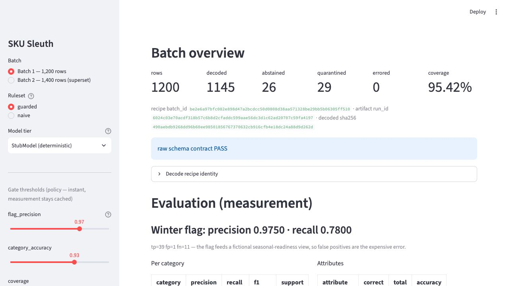
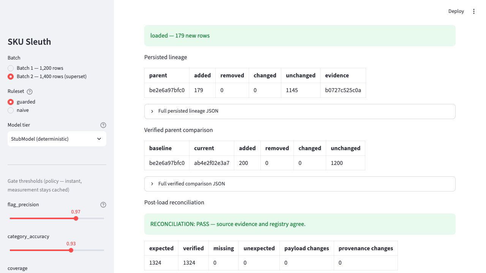

# SKU Sleuth

An interactive demonstration of a batch classification workflow with quality
gates: messy synthetic product titles are decoded by a tiered engine, scored
against a curated gold set, judged by declarative thresholds, and loaded into
SQLite only when the gate passes — with artifact hashes binding each approval
to the exact bytes it evaluated. Versioned schema checks, deterministic batch
diffs, persisted lineage, and post-load reconciliation make the evidence
inspectable instead of implicit.

*(the app rendering the committed example data)*

One row, end to end:

    norvikka rubber rh winter wiper blade set of 12

    {"attributes": {"material": "rubber", "pack_count": 12, "position": "right"}, "category": "Visibility", "evidence": "rules:brand=NORVIKKA;kw=WIPER BLADE;flag=WINTER", "is_winter_rated": true, "row_id": "R0061", "sku": "NVK-9327", "subcategory": "Wiper Blades", "tier": "rules"}

## Run it

    uv sync
    uv run streamlit run app.py

Headless (used by CI): `uv run python scripts/run_pipeline.py --scenario
passing --workdir runs/demo`. A successful exit requires the gate to pass,
the load to complete (or be an exact no-op), and reconciliation to pass. Add
`--baseline-dir runs/prior` to produce an exploratory A→B comparison report;
the loader separately replays contractual lineage from its verified registry
parent.

## Two tradeoffs this project demonstrates

**Precision over coverage.** Every tier abstains rather than guesses, so
coverage is honestly 0.9542 — 26 rows abstained and 29 were quarantined out
of 1,200 — and the winter flag (which feeds a fictional seasonal-readiness
view where a false positive is the expensive error) holds precision 0.975 at
recall 0.780. Shipping less beats shipping wrong.

**Measurement is not policy.** `evaluate` measures once; `gate` judges the
cached report against `gates.toml`. In the app, moving a threshold slider
re-judges instantly while toggling the ruleset visibly re-decodes — that
asymmetry is the point. The same eval report can be judged by different
policies.

## What the gate actually prevents

`examples/failing_run/` is a committed run with a deliberately naive rule
enabled (winter flag defaulted by brand): flag precision drops to 0.7656,
the gate fails, the process exits nonzero, and the loader refuses the batch.
The app's "tamper" toggle shows the other guard: flip one byte of the
approved artifact and the load refuses on hash mismatch.

The passing bundle also records:

- a canonical **recipe ID** over raw records, decoder/schema versions, rule
  implementation and ruleset, catalog, brand configuration, and model
  identity/fixture;
- a separate **run ID** over the recipe plus decoded/rejected artifact bytes,
  so a nondeterministic adapter cannot hide different output behind the same
  recipe;
- raw-schema drift (`none`, `additive`, or `breaking`) with explicit field
  events and missing-vs-empty value evidence;
- deterministic added/removed/changed/unchanged counts, field changes, and
  decoded↔reject transitions;
- threshold-keyed gate decisions kept separate from measurement identity, so
  the same measured batch can be re-judged without a false batch conflict;
- SQLite lineage whose comparison is replayed from stored parent outcomes,
  plus count-and-hash-anchored snapshots that detect deleted or edited
  derived audit metadata as well as missing, unexpected, malformed,
  payload-mutated, and provenance-mutated product rows.

*(the second batch replayed against its stored parent, followed by a source-to-registry reconciliation)*

These SHA-256 links are **unsigned consistency evidence**, not authentication
or authorization. The loader assumes trusted local code and recomputes the
evaluation and gate from one read of the bound artifacts. The chain catches
stale, mixed, edited, and internally inconsistent bundles; it does not prove
who produced them. A production approval system would sign attestations and
protect keys and artifact storage outside this repository.

Database timestamps are informational audit labels. Reconciliation verifies
derivable IDs, counts, hashes, links, decisions, snapshots, and outcomes; it
does not authenticate wall-clock provenance.

## Design notes and limits

- The catalog is synthetic and self-generated; the rules' author also wrote
  the generator. Mitigations: seeded challenges the rules deliberately do not
  handle (see the confusion pairs and known failures below), a hand-curated
  gold set with adjudication notes (`seeds/GOLD_SET.md`), and honest metrics.
- Known, deliberate failures: a stray trailing "L" (a crate code, not a size)
  on two Apparel rows is read by the rules as a garment size — a documented
  attribute miss; and NORVIKKA winter-bias rows with the winter truth but no
  winter token in the title are token-suppressed challenge rows that the
  evidence-based ruleset cannot see, showing up as recall misses (the flag
  recall cost above) rather than a brand-default guess.
- Gate thresholds are illustrative demo defaults, not derived from any
  production system (`gates.toml` documents the one-false-positive math).
- The model tier defaults to a deterministic stub; the optional Anthropic
  adapter abstains on any error and is excluded from determinism claims.
- Input-column additions are retained as visible drift evidence but ignored by
  the current decoder. Missing required columns, empty batches, duplicate
  `row_id`s, mixed decoded/reject outcomes, and malformed artifact schemas fail
  closed.
- SQLite is an append-only demonstration store. Existing natural keys must be
  canonical-payload equivalent; changed content is a hard conflict, never an
  `INSERT OR IGNORE`. Snapshot removals are reported in lineage but do not
  delete historical rows. Exact concurrent loads serialize to one insert and
  verified no-ops; foreign keys and a strict boolean `CHECK` protect the
  registry schema.
- Full design: `docs/design.md`.

Every product, brand, SKU, and label in this repository is synthetic and was
generated for this project. Any resemblance to real products, brands, or
companies is coincidental. No third-party or proprietary material is included.

MIT license.
